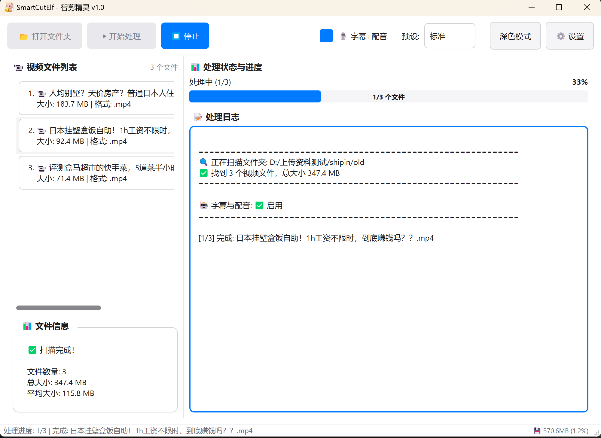

# SmartCutElf - 智剪精灵

AI驱动的视频自动剪辑工具，基于语音识别和智能分析自动生成精彩片段。

## 快速开始

### 安装依赖
```bash
pip install -r requirements.txt
```

### 运行程序
```bash
python main.py
```

### 打包程序
```bash
python scripts/build.py
# 或使用快捷方式
.\快速打包.bat
```

## 核心功能

- 🎬 **智能剪辑** - AI自动识别视频精彩片段
- 🎙️ **语音识别** - 基于Whisper模型的语音转文字
- 📝 **字幕生成** - 自动生成时间轴精确的字幕
- ⚙️ **灵活配置** - 支持自定义输出格式、分辨率等参数
- 🎨 **现代UI** - 简洁易用的图形界面

## 界面预览

<div align="center">
    
    <p><i>主界面 - 简洁直观的操作面板</i></p>
    <br/>
    
    <p><i>处理状态 - 实时显示进度和日志</i></p>
    <br/>
    
    <p><i>设置选项 - 丰富的自定义配置</i></p>
</div>

## 文档

- [使用说明](docs/使用说明.md) - 用户操作指南
- [启动指南](docs/启动指南.md) - 开发环境配置
- [部署指南](docs/部署指南.md) - 打包和发布说明
- [FFmpeg安装](docs/FFmpeg安装指南.md) - FFmpeg配置教程
- [开发笔记](docs/DEV_NOTES.md) - 技术要点和问题记录

## 项目结构

```
SmartCutElf/
├── src/              # 源代码
│   ├── core/        # 核心处理模块
│   ├── ui/          # 用户界面
│   └── utils/       # 工具函数
├── assets/          # 资源文件（图标等）
├── scripts/         # 构建脚本
├── docs/            # 文档
└── main.py          # 程序入口
```

## 系统要求

- Python 3.9+
- Windows 10/11 (主要支持平台)
- FFmpeg (必需，用于视频处理)
- 4GB+ 内存

## 技术栈

- **UI框架**: PyQt5
- **AI模型**: OpenAI Whisper
- **视频处理**: FFmpeg
- **配置管理**: YAML

## 开发

详见 [开发笔记](docs/DEV_NOTES.md)

## 许可证

本项目仅供学习和个人使用。
